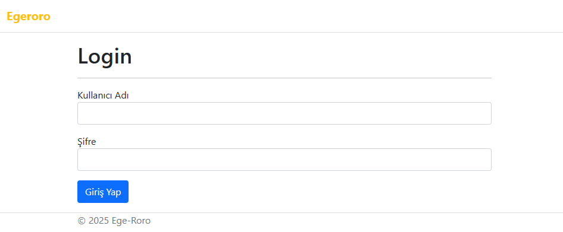
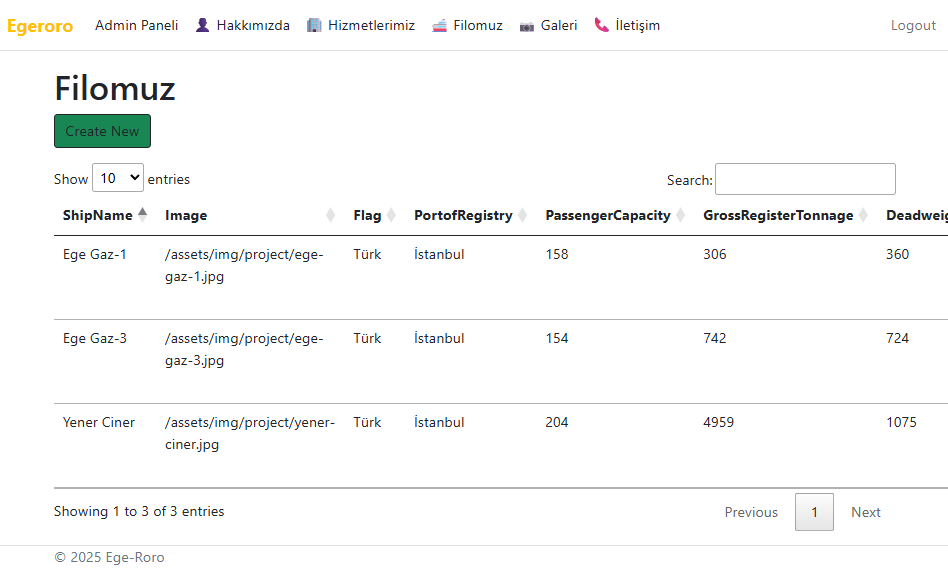

# Egeroro

Egeroro is a four-layered .NET 6 solution designed using the Razor Pages framework. The project is a dynamic reimplementation of an existing static website with an addition of **Admin panel**. Instead of serving content from static files, this application stores and manages all content in a (SQL Server) database using Entity Framework Core. The project is organized into distinct layers to promote separation of concerns, maintainability, and scalability.

---

## 📦 Features

- Website content (fleet, gallery, about us, services, team, etc.) is managed via the database.  
- Clean separation of concerns using **Entity**, **Data**, and **Business** layers.  
- Responsive design and interactive UI using modern JavaScript libraries and CSS.  
- Easily extensible for future features or content types.

---

## 🧰 Technologies Used

- **Frontend:** Razor Pages (.NET 6), HTML, CSS, JavaScript
- **Backend:** ASP.NET Core, Entity Framework Core (Code-First), FluentValidation, Microsoft Identity
- **Database:** SQL Server

---

## 🚀 Getting Started

### Prerequisites

- [.NET 6 SDK](https://dotnet.microsoft.com/download/dotnet/6.0)  
- [Visual Studio 2022](https://visualstudio.microsoft.com/) (recommended)
- [SQL Server](https://www.microsoft.com/en-us/sql-server/sql-server-downloads)  
- [SQL Server Management Studio (SSMS)](https://learn.microsoft.com/en-us/sql/ssms/download-ssms)

### Setup Instructions

1. **Clone the repository**  
   ```bash
   git clone https://github.com/m-akgul/Egeroro.git
   cd Egeroro
   ```

2. **Configure the Database**  
   - Open `Egeroro.Data/Concrete/Context.cs` and update the connection string.  

3. **Import the Database:**
   - Open SSMS and connect to your server.
   - Right-click on **Databases** → **Import Data-Tier Application**.
   - Select the `.bacpac` file found in the project directory to create the database.

4. **Run the Application**  
   - Open `Egeroro.sln` in Visual Studio 2022.
   - Restore NuGet packages (if not automatically restored).
   - Set **Egeroro.UI** as the startup project in Visual Studio and press **F5**  
     _or_  
   - From the command line:  
     ```bash
     dotnet run
     ```


---

## 📂 Project Structure

1. **Egeroro.Entity** 
   - **Purpose:** Contains entity classes and Identity models.
   - **Details:**  
      - Defines the core domain models (e.g., Fleet, User, etc.).
      - Includes Identity support via `Microsoft.AspNetCore.Identity` and `Microsoft.AspNetCore.Identity.EntityFrameworkCore`.
   - **References:** No project references.

2. **Egeroro.Data**
   - **Purpose:** Data access layer using Entity Framework Core.
   - **Details:**  
     - Implements repositories and database context.
     - Handles all database operations.
     - Uses `Microsoft.EntityFrameworkCore` and related packages.
   - **References:**  
     - Depends on `Egeroro.Entity`.

3. **Egeroro.Business**
   - **Purpose:** Business logic and validation layer.
   - **Details:**  
     - Contains service classes and business rules.
     - Integrates validation using FluentValidation.
   - **References:**  
     - Depends on `Egeroro.Entity` and `Egeroro.Data`.

4. **Egeroro.UI**
   - **Purpose:** Presentation layer using ASP.NET Core Razor Pages.
   - **Details:**  
     - Implements the user interface and handles user interactions.
     - References business and entity layers for data and logic.
   - **References:**  
     - Depends on `Egeroro.Business` and `Egeroro.Entity`.


---

## 🔐 Sample Admin User

- To access the admin panel, type **/Admin/Login** after the URL.

| Username  | Password  |
|-----------|-----------|
| m-akgul   | 123456    |

### 🖼️ Screenshots

#### Home Page


#### Admin Panel


---

## 📜 License

This project is for educational and demonstration purposes. Please ensure you have rights to use any third-party assets or content.

---

**Developed with .NET 6 Razor Pages and Entity Framework Core.**
